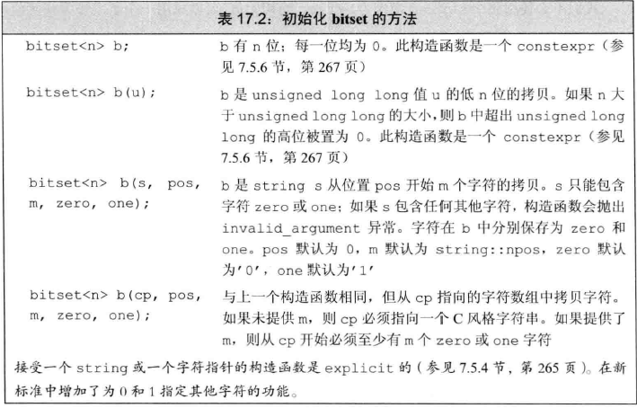
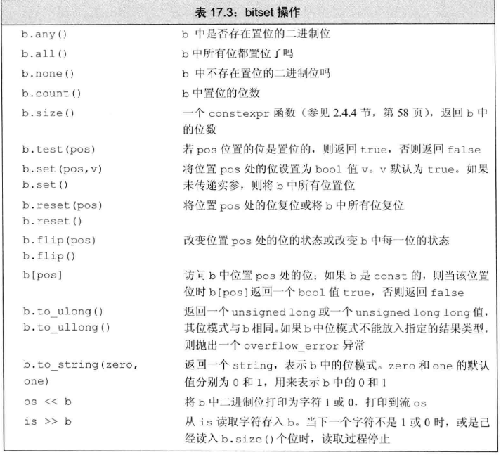

> C++ Primer 17.2

# bitset类型

定义在头文件bitset中
置位：1，复位：0

## 定义与初始化bitset


利用unsigned值初始化bitset时，如果unsigned值比位数高，则其高位被丢弃，若小则高位被置为0.
使用一个string或者字符数组指针来初始化bitset时，**值得注意的是string的高位在bitset中是低位**


## bitset操作


使用cin输入流读入时，保存到一个临时的string对象中，当读取到对应的bitset大小，或者遇到不是0或1的字符时，或者遇到文件尾或者输入错误时，读取过程才停止，用临时的string对象来初始化bitset。
使用to_ulong或者to_ullong时，只有**bitset大小等于对应的大小**的时候，才能使用这两个操作，否则抛出overflow_error异常。

## example

> hiho一下 第147周(https://hihocoder.com/contest/hiho147/problem/1)
> **描述**
> 小Hi从小的一大兴趣爱好就是学习，但是他发现尽管他认真学习，依旧有学神考的比他好。小Hi在高中期间参加了市里的期末考试，一共五门：语文、数学、英语、物理、化学。成绩出来之后，小Hi发现有些同学，所有科目都考的比他好，他很烦恼。所以他想知道所有科目都比自己名次靠前的同学的人数。为了方便，可以认为不存在两个人某一门名次是相同的。其他同学们也想知道有多少人全面碾压了他们，所以你需要对所有人输出答案。
> 
> **输入**
> 第一行，一个正整数N(N <= 30000)，表示人数。
> 接下来N行，每行五个整数，分别表示五门课依次的排名。
> 输出
> 输出共N行，每行一个整数，表示答案。
> 
> **样例输入**
> 4
> 1 1 2 2 1
> 2 3 3 3 2
> 3 2 1 1 3
> 4 4 4 4 4
> 
> **样例输出**
> 0
> 1
> 0
> 3

思路：首先设法将每门科目的排名列出，开一个二维的bitset数组，根据每门科目的排名利用&运算，求出所有科目都比当前人名次靠前的同学的人数。

```C++ 
#include<bits/std++.h>
using namespace std;

#define PI 3.14159265
#define e 2.71828182

typedef long long ll;
typedef pair<int, int> P;
const int MAX_N = 30000 + 5;
const int INF = 0x3f3f3f3f;
bitset<MAX_N> ls[5][MAX_N];//ls[j][i]表示第j个科目排名为1到i的是哪些人
int arr[5][MAX_N];//arr[j][i]表示第j个科目排名为i的是谁
bitset<MAX_N> ans;
int _rank[5][MAX_N];//_rank[j][i]表示第j个科目第i位同学的排名

int main() {
    ios::sync_with_stdio(false);
    cin.tie(NULL);
    cout.tie(NULL);
    int n;
    scanf("%d", &n);
    for (int i = 1; i <= n; ++i) {
        for (int j = 0; j < 5; ++j) {
            int val;
            scanf("%d", &val);
            arr[j][val] = i;
            _rank[j][i] = val;
        }
    }
    for (int j = 0; j < 5; ++j) {
        for (int i = 1; i <= n; ++i) {
            if (i == 1) ls[j][i] = 0;
            else {
                ls[j][i] = ls[j][i - 1];
                ls[j][i].set(arr[j][i - 1]);//名次从前往后走，依次将上一个人设为1
            }
        }
    }
    for (int i = 1; i <= n; ++i) {
        ans = ls[0][_rank[0][i]];
        for (int j = 1; j < 5; ++j) {
            ans &= ls[j][_rank[j][i]];
        }
        cout << ans.count() << endl;
    }
    return 0;
}
```

